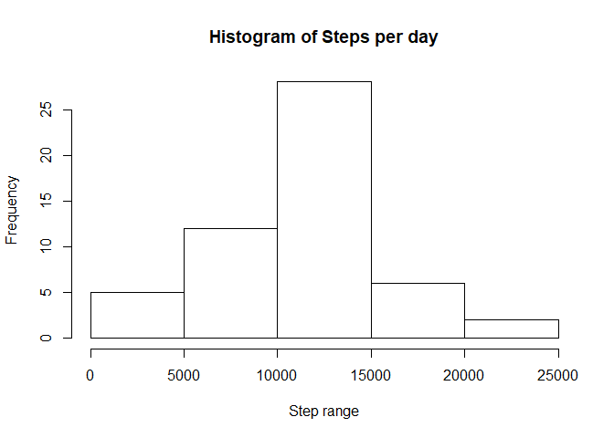
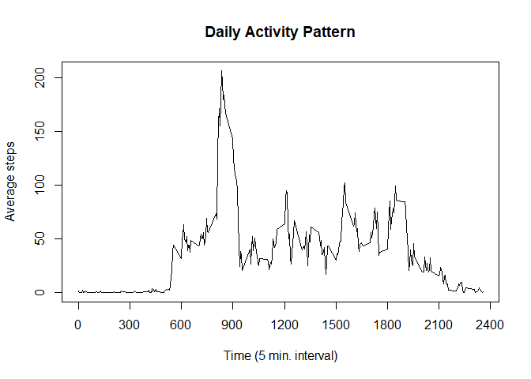
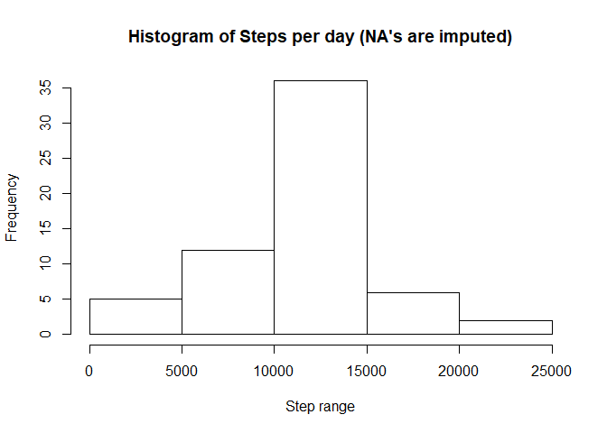
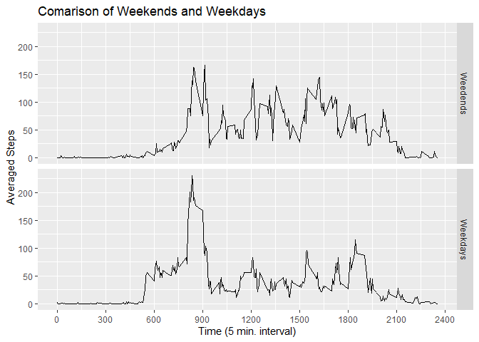

## Loading and preprocessing the data

```r
# Checking if folder exists
if (!file.exists("./activity.csv")) { 
  unzip("activity.zip") 
}
# Read the data
activity <- read.csv("activity.csv")
activity$date <- as.Date(activity$date)
str(activity)
```

```
## 'data.frame':	17568 obs. of  3 variables:
##  $ steps   : int  NA NA NA NA NA NA NA NA NA NA ...
##  $ date    : Date, format: "2012-10-01" "2012-10-01" ...
##  $ interval: int  0 5 10 15 20 25 30 35 40 45 ...
```
## What is mean total number of steps taken per day?

0. Load package

```r
# import dplyr package
library(dplyr)
```

```
## 
## Attaching package: 'dplyr'
```

```
## The following objects are masked from 'package:stats':
## 
##     filter, lag
```

```
## The following objects are masked from 'package:base':
## 
##     intersect, setdiff, setequal, union
```

1. Calculate the total number of steps taken per day

```r
steps_per_day <- group_by(activity, date) %>% 
  filter(!is.na(steps)) %>% 
  summarise(daily_step = sum(steps, na.rm = TRUE), 
            .groups = 'drop') 
```

2. Make a histogram of the total number of steps taken each day

```r
hist(steps_per_day$daily_step, main = "Histogram of Steps per day", xlab = "Step range")
```

<!-- -->

3. Calculate and report the mean and median of the total number of steps taken per day

```r
#The mean of the total number of steps are calculated as below.
mean(steps_per_day$daily_step, na.rm = TRUE)
```

```
## [1] 10766.19
```

```r
# The median of the total number of steps are calculated as below.
median(steps_per_day$daily_step, na.rm = TRUE)
```

```
## [1] 10765
```

## What is the average daily activity pattern?

1. Make a time series plot (i.e. type = "l") of the 5-minute interval (x-axis) and the average number of steps taken, averaged across all days (y-axis)

```r
daily_activity <- group_by(activity, interval) %>% 
  summarise(averaged_steps = mean(steps, na.rm = TRUE),
            .groups = 'drop')

{plot(x = daily_activity$interval, y = daily_activity$averaged_steps, type ="l",
  main = "Daily Activity Pattern", xlab ="Time (5 min. interval)", ylab = "Average steps",  xaxt="none")
axis(1, seq(0, 2400,300))}
```

<!-- -->

2. Which 5-minute interval, on average across all the days in the dataset, contains the maximum number of steps?


```r
daily_activity$interval[which.max(daily_activity$averaged_steps)]
```

```
## [1] 835
```

## Imputing missing values

1. Calculate and report the total number of missing values in the dataset (i.e. the total number of rows with NAs)

```r
sum(is.na(activity$steps))
```

```
## [1] 2304
```

2. Devise a strategy for filling in all of the missing values in the dataset. The strategy does not need to be sophisticated. For example, you could use the mean/median for that day, or the mean for that 5-minute interval, etc.

```r
# My plan is to substitute the missing values with the averaged steps of the same time periods calculated above as the daily activity pattern.
```

3. Create a new dataset that is equal to the original dataset but with the missing data filled in.


```r
activity2 <- activity

list_NA <- which(is.na(activity2$steps))

for(i in list_NA){
  activity2$steps[i] <- daily_activity$averaged_steps[(i-1)%%288 + 1]
}
```

4. Make a histogram of the total number of steps taken each day and Calculate and report the mean and median total number of steps taken per day. Do these values differ from the estimates from the first part of the assignment? What is the impact of imputing missing data on the estimates of the total daily number of steps?


```r
steps_per_day2 <- group_by(activity2, date) %>% 
  summarise(daily_step = sum(steps, na.rm = TRUE), 
            .groups = 'drop') 

hist(steps_per_day2$daily_step, main = "Histogram of Steps per day (NA's are imputed)", xlab = "Step range")
```

<!-- -->

## Are there differences in activity patterns between weekdays and weekends?

1. Create a new factor variable in the dataset with two levels – “weekday” and “weekend” indicating whether a given date is a weekday or weekend day.

```r
# Change the system locale if needed
if(!Sys.getlocale("LC_TIME") == "English_United States.1252"){
  # Store original locale before changes it
    Original_locale <- Sys.getlocale("LC_TIME")
  # Change locale to US
    Sys.setlocale("LC_TIME","us")
}
```

```
## [1] "English_United States.1252"
```

```r
# Calculate averaged steps of Weekends and Weekdays
daily_activity2 <- activity2 %>% 
  mutate(wd1 = weekdays(date)) %>% 
  mutate(wd2 = if_else(wd1 %in% c("Saturday", "Sunday"),
                      "Weedends", "Weekdays")) %>% 
  group_by(interval, wd2) %>% 
  summarise(averaged_steps = mean(steps, na.rm = TRUE),
            .groups = 'drop')

# Restore the system locale if needed
if(Sys.getlocale("LC_TIME") == "English_United States.1252"){
  # Change locale to the original one
    Sys.setlocale("LC_TIME", Original_locale)
}
```

```
## [1] "Japanese_Japan.932"
```

2. Make a panel plot containing a time series plot (i.e. type = "l") of the 5-minute interval (x-axis) and the average number of steps taken, averaged across all weekday days or weekend days (y-axis). See the README file in the GitHub repository to see an example of what this plot should look like using simulated data.


```r
library(ggplot2)
ggplot(daily_activity2, mapping = aes(x = interval, y = averaged_steps)) +
  geom_line() + 
  scale_x_continuous(breaks=seq(0, 2400, 300)) +
  ggtitle("Comarison of Weekends and Weekdays") +
  xlab("Time (5 min. interval)") + 
  ylab("Averaged Steps") +
  facet_grid(wd2 ~ .)
```

<!-- -->

